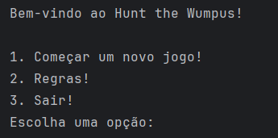

# Hunt The Wumpus

## Desenvolvimento

- O jogo Hunt the Wumpus foi desenvolvido em Java, utilizando a IDE IntelliJ IDEA.
- O jogo foi desenvolvido por Lucca Rebello Toledo e João Victor Pires e realizando a utilização de nós para estruturação dos dados das cavernas.
- Nosso objetivo foi deixar uma jogativa mais tranquila com uma pitada de suspense e desafio, para que o jogador possa se divertir e se entreter com o jogo.
- As cavernas possuem quatro direções possíveis, sendo elas: Norte, Sul, Leste e Oeste.
- O jogador pode se movimentar entre as cavernas e atirar flechas para tentar acertar o Wumpus.
- Entre a caçada, o jogador pode sentir e ouvir os perigos que estão próximos a ele, como o odor do Wumpus, a brisa do poço sem fundo e o bater de asas dos morcegos.

## Como jogar?
- O jogo é baseado em terminal, sendo assim, para jogar é preciso realizar o clone dos arquivos em sua máquina para executar o código Java.
```bash
git clone https://github.com/LuccaRebelloToledo/hunt-the-wumpus.git
```

- Você deverá utilizar uma IDEA de sua escolha, como citado abaixo, utilizamos a IDEA IntelliJ. Contudo, após realizar o clones dos arquivos, será necessário importar o projeto para a IDEA e executar o código atrás do método `MAIN` encontrado na classe Main.

- Após execução do método `MAIN` terá o seguinte Output em seu terminal:



## Regras - Hunt the Wumpus.
1. Existem três perigos! Sendo estes:
   - Um poço sem fundo (Você sentirá uma brisa por perto).
   - Uma colônia de morcegos que irá pegá-lo e deixá-lo em uma caverna aleatória (Você consegue ouvir o bater de asas).
   - Um wumpus temível, faminto e sem banho (Você consegue sentir um odor).
2. Você pode encontrar uma flecha lançada por um caçador anterior.
3. O jogo acaba quando você não tiver mais flechas ou se cair em um poço sem fundo ou se você for devorado pelo Wumpus.
4. O "X" no mapa representa a sua localização atual.
5. Sobreviva! Você tem 5 flechas e 3 flechas espalhadas entre as 25 cavernas disponíveis para serem exploradas.

## Experiência de Jogo
- Esperamos que se divirtam e tenham uma ótima caça ao wumpus!

## Ferramentas utilizadas
- Java 17
- IntelliJ IDEA
- Git